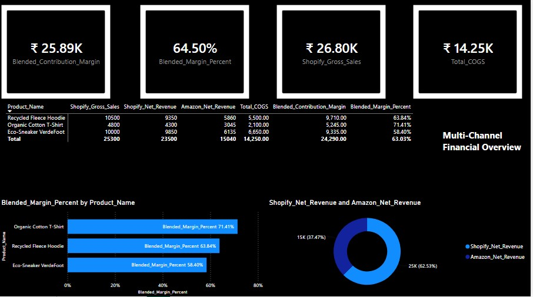
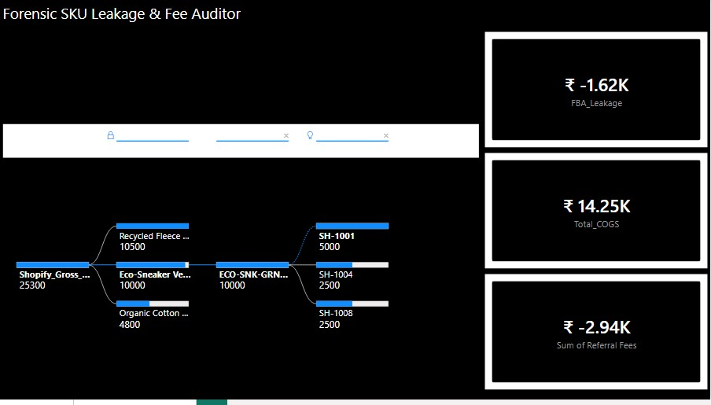
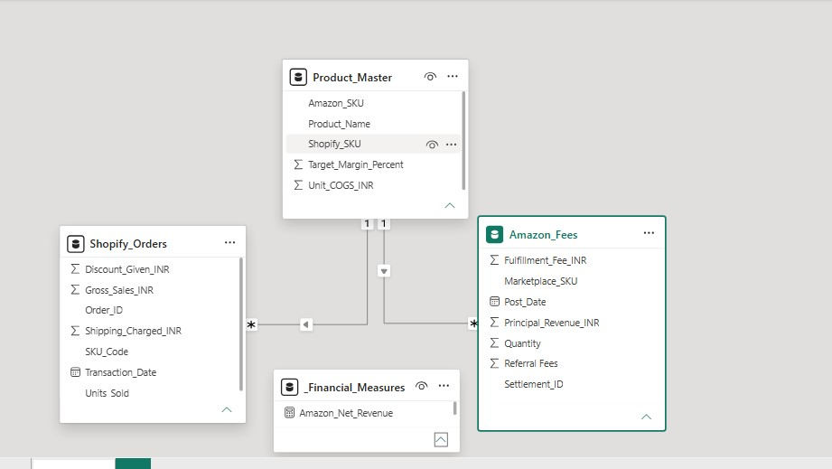
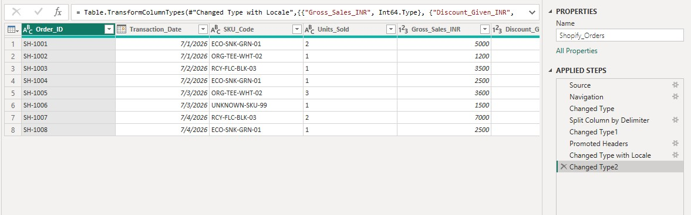

<table>  <tr>    <td>      <h1>Multi-Channel E-Commerce Margin Leakage Engine & Forensic Fee Auditor</h1>      <p><em>An enterprise-grade financial data auditing system built to isolate hidden operational fee variances across Shopify and Amazon storefronts.</em></p>      <p><strong>Engineered by:</strong> Vinay Prakash Tiwari</p>    </td>    <td width="200px" align="center">          </td>  </tr></table>
An advanced financial analytics engine built in Power BI to audit and reconcile multi-channel e-commerce profitability across Amazon FBA and Shopify storefronts. This dashboard bridges isolated sales data to expose hidden fee leakages, unearned FBA charges, and platform-specific referral costs, providing stakeholders with true blended margin visibility.

---

## 🎥 Project Walkthrough Presentation
👉 [**Click here to watch my 3-minute video overview on Loom**](https://www.loom.com/share/4bebafedec784d789c7fc2a53056d366)


*Note: In this video, I walk through the core business problem, my ETL data pipeline engineering within Power Query, and the final analytical frontend interface.*

---


## 📈 Key Business Insights & Engineering Architecture

*  **Blended Margin Tracking:** Engineered unified data relationships across disparate platform API schemas to track true Contribution Margin ($25.89K) and Blended Margin Percent (64.50%).
*   **Forensic SKU Auditing:** Created a structural data decomposition breakdown to isolate systemic fee leakage points down to individual parent/child SKU allocations.
*  **Data ETL Pipeline Mastery:** Built a custom Power Query ETL pipeline to take raw, comma-separated stream operational tables, clean structural text anomalies using custom splitting delimiters, and construct an integrated star-schema model view.
*  **Advanced Financial Modeling:** Isolated hidden operational variances by mapping Total COGS against platform referral payouts to protect retail net margins.

## 📂 Repository Contents

* * MultiChannel_MarginLeakage_Engine_V2.pbix * : Full interactive Power BI Desktop analytical hub and metrics canvas.
* * MultiChannel_Ecom_RawData.xlsx * : Raw source dataset demonstrating multi-tab text-parsing extraction pipelines.
## 📊 Analytics Interface & Engine Architecture

### Executive Performance Hub
The primary visualization canvas providing high-level executive variance tracking across distributed sales channels:


### Forensic SKU Leakage Breakdown
Our diagnostic layout utilizing decomposition structures to isolate systemic fee anomalies down to the item level:


### Core Data Model Architecture
The production-grade star-schema configuration linking core transaction facts with unified master records:


### Automated ETL Pipeline
Custom text-parsing rules and structural step splits built in Power Query to cleanly process incoming data streams:


## 🧮 Advanced DAX Financial Measures

While the data modeling structure handles the data relationship framework, the engine relies on specialized DAX metrics to dynamically compute financial impact across shifting multi-platform fee structures:

### 1. Blended Contribution Margin
Calculates true net profitability across all digital channels simultaneously by deducting variable platform referral fees, fulfillment costs, and structural COGS.

```dax
Blended Contribution Margin = 
SUM(Shopify_Orders[Net Revenue]) + SUM(Amazon_Fees[Amount]) - SUM(Product_Master[Total COGS])
```
### 2. Forensic Margin Leakage %
```dax
Margin Leakage Pct = 
DIVIDE(
    [Total Hidden Leakages], 
    SUM(Shopify_Orders[Gross Sales]) + SUM(Amazon_Fees[Gross Sales]), 
    0
)
```
